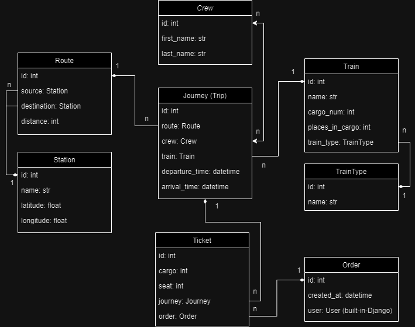

# Train Station API Service
> **Welcome to the Train Station API Service:** System of managing trains, journeys, crew and stations.

###### The Train Station API Service is built using Django Rest Framework and aims to simplify the management and retrieval of information related to train stations and allow travellers to easily book tickets for upcoming journeys using trains.

## Key Features

* **Authentication:** Users are authenticated using JWTs, which are issued upon successful login and provide secure access.
* **Admin Panel:** Admins can easily add, edit, and delete data, ensuring efficient control over the application.
* **Documentation:** Comprehensive API documentation is available through the Swagger UI.
* **Train Management:** Define and categorize different types of trains, capturing essential details such as capacity and images.
* **Crew Management:** Manage crew members, including their first and last names.
* **Station Details:** Store comprehensive data about stations, including their names, latitude and longitude.
* **Route Definition:** Define routes between source and destination stations, aiding in the organization of journeys connections.
* **Journey Tracking:** Monitor journeys with detailed information about the assigned route, train, departure and arrival times. Additionally, manage the crew assigned to each journey.
* **Order and Ticket System:** Record and manage orders made by users, and handle tickets for specific journeys and orders, including cargo number and seat details.

## DB structure 



## Installing Using GitHub

Ensure you have `Python 3` installed.
Install `PostgreSQL` and create db.

```bash
git clone https://github.com/KolBohdan/train-station-api-service
cd train_station_service
python3 -m venv venv
source venv/Scripts/activate
pip install -r requirements.txt
```
### Set your variables
```bash
set DJANGO_SECRET_KEY=<your secret key>
set DJANGO_DEBUG=<your debug value>
set DJANGO_ALLOWED_HOSTS=<your allowed hosts>
set POSTGRES_HOST=<your Postgres host>
set POSTGRES_DB=<your Postgres database>
set POSTGRES_USER=<your Postgres user>
set POSTGRES_PASSWORD=<your Postgres password>
```
### Migrate db and run server
```bash
python manage.py migrate
python manage.py runserver
```

## Run with docker

`Docker` should be installed.

```
docker-compose build
docker-compose up
```

## Getting access
- create a user via **/api/user/register/**
- get access token via **/api/user/token/**
